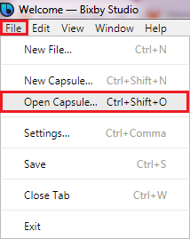
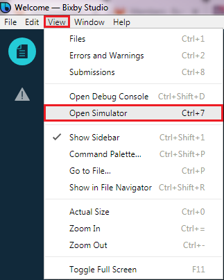
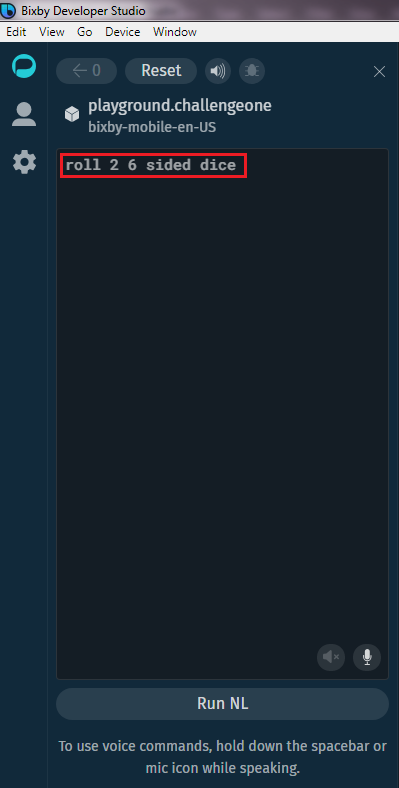
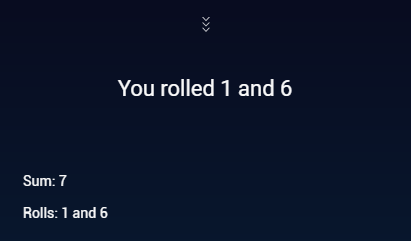

# CHALLENGE 1 - ROLL DICE                            
                                                                             
### **OBJECTIVE:** &nbsp;&nbsp; Set up the toys and start rolling the dice! :)         
                                                                                                                                
                        
# YOUR TASK

1. Go to the [bixbydevelopers.com](https://bixbydevelopers.com/ "bixbydevelopers.com") website, register a new account and sign up.

2. Download the Bixby Studio from [bixbydevelopers.com](https://bixbydevelopers.com/ "bixbydevelopers.com").

3. Install Bixby Studio on your computer.

4. Git clone or download [challenge-1](https://bixbydevelopers.com/ "challenge-1").

5. In the top menu of Bixby Studio choose **File --> Open Capsule...**

    

6. In the new window choose the folder you have downloaded or cloned the **challenge-1 capusle** to and press the **Select Folder** button.

7. Next run the Bixby Studio Simulator by selecting from the top menu **View --> Open Simulator**.

    

8. On the left, in the dark text field type in an utterance **roll 2 6 sided dice** and press enter.

    

9. Bixby will respond with **two results** of throwing **2 dices** with **6 sides!**

    

10. **Voila! You have completed your first CHALLENGE!** 
  
# SUMMARY

### **Congratulations!** 
  
You have installed Bixby Studio, downloaded your first BIXBY project, opened it in the Bixby Studio and tested with the Bixby Simulator. 

You are now ready to do more!